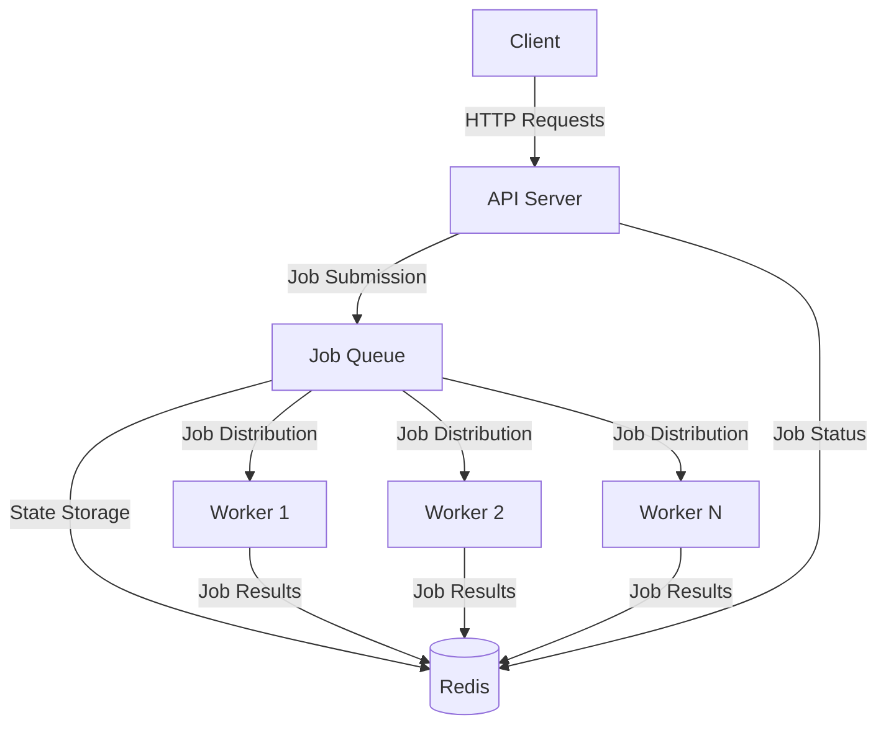
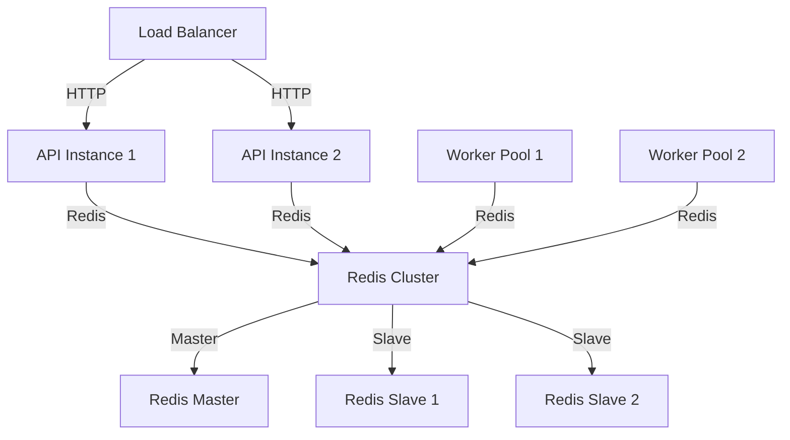

# DaMariS Architecture Documentation

## System Overview

DaMariS (Distributed Messaging System) is a scalable, fault-tolerant distributed messaging system designed to handle various types of jobs in a distributed environment. The system is built with TypeScript and uses modern technologies to ensure reliability and scalability.

## Architecture Components

### 1. API Server
- **Technology**: Express.js with TypeScript
- **Purpose**: Handles job submission and monitoring
- **Key Features**:
  - RESTful endpoints for job management
  - Job status tracking
  - Pagination and filtering support
  - Error handling and validation

### 2. Job Queue System
- **Technology**: Bull Queue with Redis
- **Purpose**: Manages job distribution and processing
- **Key Features**:
  - Persistent job storage
  - Automatic retries with exponential backoff
  - Job type-specific queues
  - Job state management

### 3. Worker System
- **Technology**: Node.js with TypeScript
- **Purpose**: Processes jobs in parallel
- **Key Features**:
  - Multiple worker instances
  - Automatic job recovery
  - Job type-specific processors
  - Performance monitoring

### 4. Data Storage
- **Technology**: Redis
- **Purpose**: Stores job data and queue state
- **Key Features**:
  - Persistent storage
  - Fast access
  - Pub/sub capabilities
  - Data durability

## System Architecture Diagram

## Design Decisions

1. **TypeScript Usage**
   - Provides type safety and better developer experience
   - Enables better code organization and maintainability
   - Reduces runtime errors through static type checking

2. **Bull Queue**
   - Chosen for its robust job processing capabilities
   - Built-in support for job retries and error handling
   - Excellent integration with Redis
   - Supports job prioritization and rate limiting

3. **Redis as Backend**
   - Fast in-memory data store
   - Built-in pub/sub capabilities
   - Persistence options for data durability
   - Excellent for queue management

4. **Docker Containerization**
   - Ensures consistent deployment environments
   - Enables easy scaling and orchestration
   - Simplifies development and testing
   - Provides isolation between components

While I considered implementing a custom queue, I chosen a [Bull Queue](https://bullmq.io) for its battle-tested reliability in production environments and comprehensive feature set. The architecture was deliberately designed with modularity in mind, encapsulating all queue-related logic within [src/jobs/queue.ts](src/jobs/queue.ts), so it can be easily replaced with minimal changes.

## Scalability Considerations

### Horizontal Scaling
1. **API Layer**
   - Can be scaled using a load balancer
   - Stateless design allows multiple instances
   - Session management handled by Redis

2. **Worker Layer**
   - Stateless workers can be scaled horizontally
   - Automatic job distribution across workers
   - No worker coordination needed

3. **Redis Layer**
   - Can be scaled using Redis Cluster
   - Supports master-slave replication
   - Provides high availability

## Future Scalability Improvements

1. **Message Broker Integration**
   - Add support for Kafka/RabbitMQ
   - Enable event-driven architecture
   - Improve message persistence

2. **Monitoring and Observability**
   - Prometheus metrics integration
   - Grafana dashboards
   - Distributed tracing

3. **Enhanced Job Management**
   - Job prioritization
   - Job scheduling
   - Job dependencies

4. **Security Enhancements**
   - API authentication
   - Rate limiting
   - Input validation

## Deployment Architecture Example

## Conclusion

DaMariS is designed with scalability, reliability, and maintainability in mind. The architecture allows for easy horizontal scaling while maintaining system stability. The use of modern technologies and best practices ensures a robust and efficient job processing system.